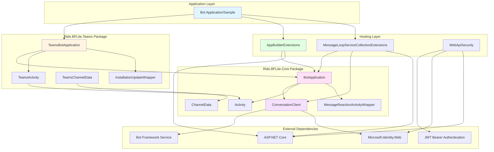
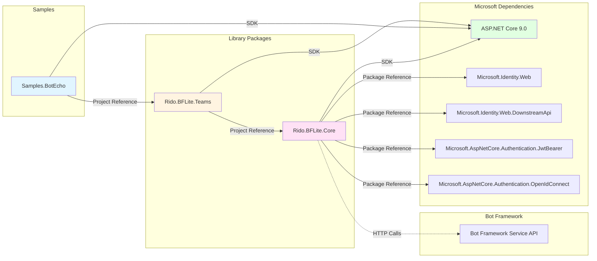
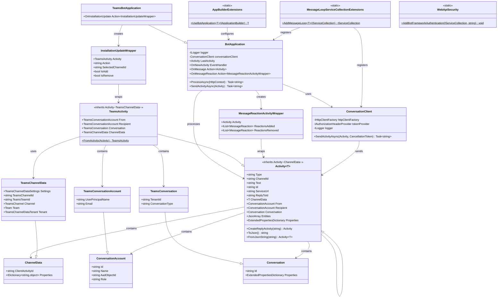
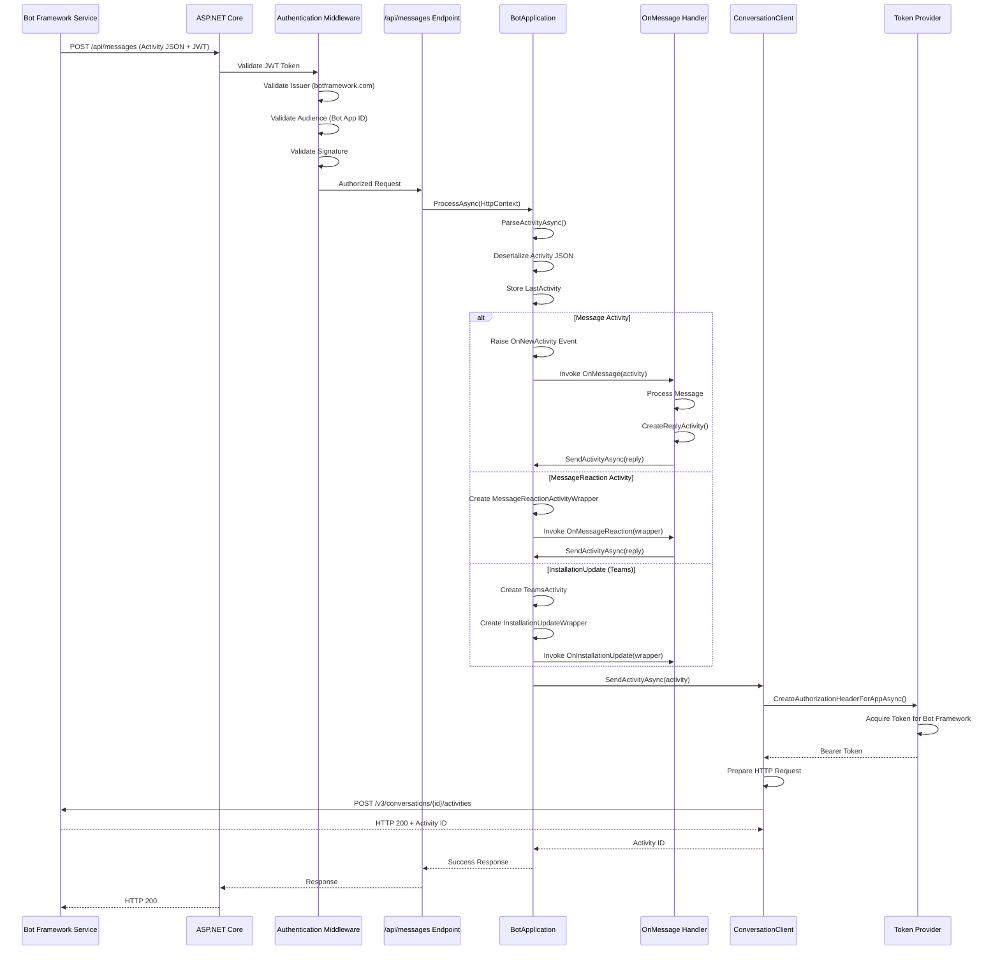
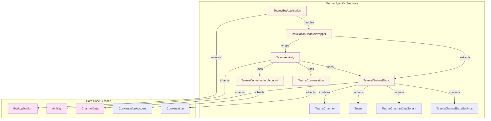
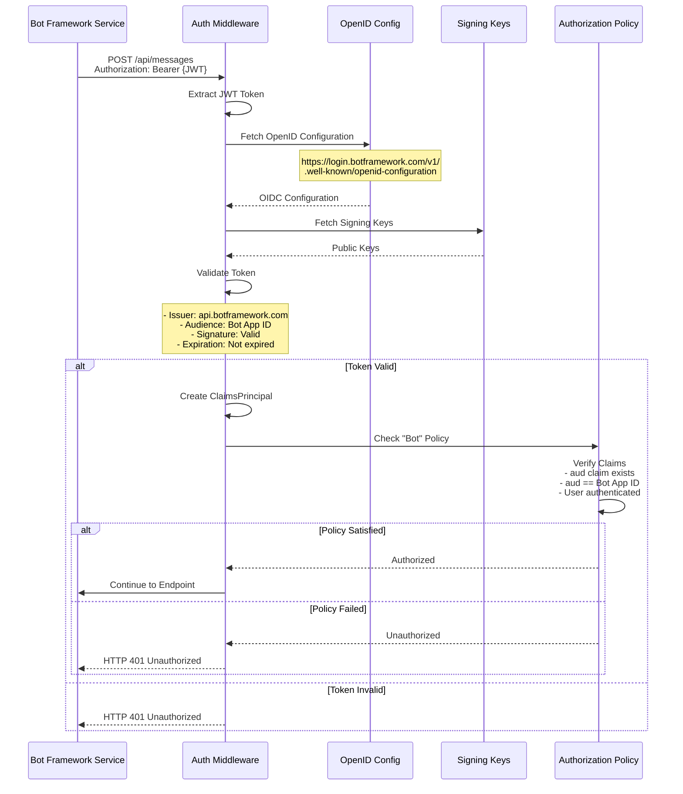
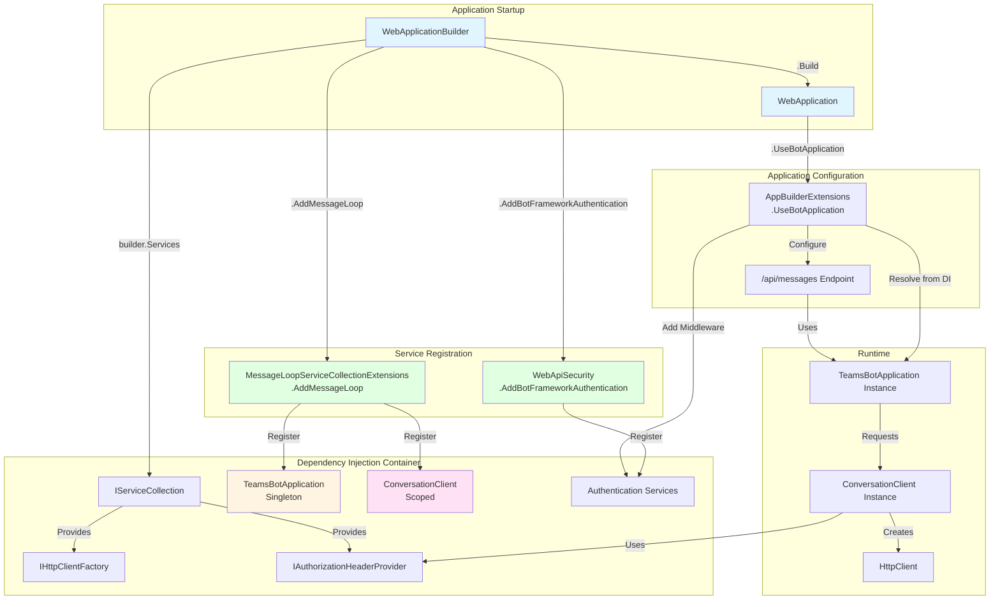
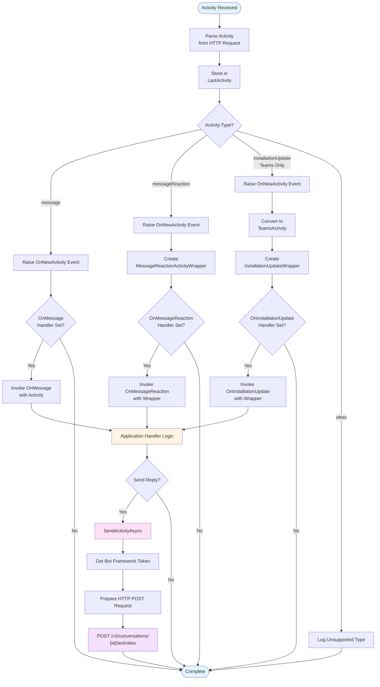
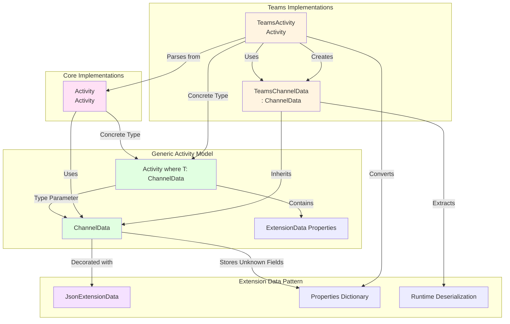
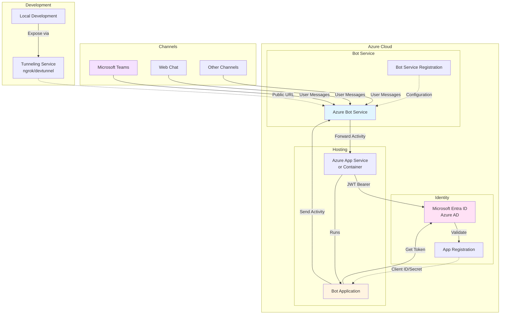

# Rido.BFLite Architecture

This document provides detailed architecture diagrams and explanations of the Rido.BFLite library structure, dependencies, and data flow.

## Table of Contents

- [Overview](#overview)
- [Component Architecture](#component-architecture)
- [Package Dependencies](#package-dependencies)
- [Class Relationships](#class-relationships)
- [Request Flow](#request-flow)
- [Teams Extension Architecture](#teams-extension-architecture)
- [Authentication Flow](#authentication-flow)

## Overview

Rido.BFLite is a lightweight library for building Microsoft Bot Framework bots with minimal overhead. It provides a streamlined API surface while maintaining full compatibility with the Bot Framework protocol.

## Component Architecture

The following diagram shows the high-level component structure and how they interact:

## Package Dependencies

This diagram illustrates the dependency relationships between packages and external libraries:

## Class Relationships

This diagram shows the detailed class relationships and inheritance hierarchy:

## Request Flow

This sequence diagram illustrates how a message is processed from the Bot Framework Service to the bot application and back:

## Teams Extension Architecture

This diagram shows how the Teams extension enhances the core library:

## Authentication Flow

This diagram illustrates the JWT authentication process for Bot Framework requests:

## Hosting and Dependency Injection

This diagram shows how the library integrates with ASP.NET Core's hosting and dependency injection:

## Activity Processing Pipeline

This flowchart shows the complete activity processing logic within BotApplication:

## Schema Extensibility Pattern

This diagram illustrates how the library uses generic types and extension data to support channel-specific data:

## Key Design Patterns

### 1. **Event-Driven Architecture**
The library uses C# events and action delegates to allow applications to respond to bot activities without subclassing:
- `OnNewActivity` - Event raised for all activities
- `OnMessage` - Action for message activities
- `OnMessageReaction` - Action for reaction activities
- `OnInstallationUpdate` - Action for Teams installation updates (Teams extension)

### 2. **Wrapper Pattern**
Complex activities are wrapped in specialized classes that extract and expose relevant data:
- `MessageReactionActivityWrapper` - Extracts reaction data from activity properties
- `InstallationUpdateWrapper` - Extracts Teams installation data and provides helper properties

### 3. **Extension Data Pattern**
JSON extension data is used throughout to preserve channel-specific fields:
- Unknown JSON properties are captured in `Properties` dictionaries
- Teams extension converts generic activities to strongly-typed models
- Allows forward compatibility with Bot Framework protocol changes

### 4. **Generic Type Constraints**
The `Activity<T>` generic class constrains channel data types:
- Base: `Activity<ChannelData>`
- Teams: `Activity<TeamsChannelData>`
- Enables type-safe channel-specific extensions

### 5. **Dependency Injection Integration**
Full integration with ASP.NET Core DI:
- Extension methods for service registration
- Scoped and singleton lifetime management
- Factory patterns for HTTP clients

### 6. **Minimal API Surface**
The library exposes a minimal, focused API:
- Single endpoint (`/api/messages`)
- Simple registration (`AddMessageLoop<T>()`)
- Simple configuration (`UseBotApplication<T>()`)
- Action-based handlers (no complex interfaces)

## Technology Stack

### Core Dependencies
- **.NET 9.0** - Latest .NET runtime
- **ASP.NET Core** - Web framework and hosting
- **System.Text.Json** - JSON serialization

### Authentication & Identity
- **Microsoft.Identity.Web** - Microsoft identity platform integration
- **Microsoft.AspNetCore.Authentication.JwtBearer** - JWT token validation
- **Microsoft.AspNetCore.Authentication.OpenIdConnect** - OpenID Connect support
- **Microsoft.Identity.Web.DownstreamApi** - Bot Framework API calls

### Bot Framework
- **Bot Framework Service API** - Cloud service for bot communication
- **Bot Framework Protocol** - Activity schema and conversation protocol

## Deployment Architecture

## Summary

Rido.BFLite provides a clean, minimal architecture for building Bot Framework bots:

1. **Core Package** - Essential bot functionality, activity schema, and Bot Framework integration
2. **Teams Extension** - Teams-specific features building on the core
3. **Hosting Integration** - Seamless ASP.NET Core integration with authentication
4. **Event-Driven Model** - Simple action-based handlers for bot logic
5. **Type Safety** - Strong typing for activities and channel data with extensibility

The architecture emphasizes:
- **Simplicity** - Minimal concepts and API surface
- **Type Safety** - Leverages C# type system
- **Extensibility** - Generic types and extension data for channel-specific features
- **Modern .NET** - Latest .NET features and patterns
- **Security** - Built-in Bot Framework authentication and authorization
